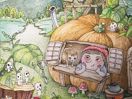
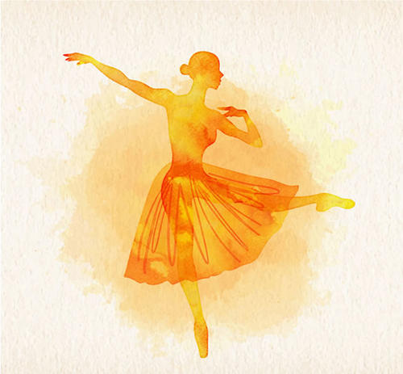

# 小南瓜的个人空间

# **欢迎来到南瓜小屋!**

##  家庭成员

 南瓜爸爸

 南瓜妈妈

 小南瓜本人

---

##  教育背景

1997年12月生于河北保定

2004年9月-2010年6月 保定市联盟西路小学

2010年9月-2013年6月 保定市第二中学分校

2013年9月-2016年6月 保定市第一中学

2016年9月-2020年6月 武汉大学 管理学学士

2020年9月-今 南京大学 硕士在读

---

## 爱好特长

* 舞蹈

> 小南瓜的古典舞、华尔兹、民族舞都不错~

* 长跑

> 每天坚持长跑的小南瓜，体质很好哦！

* 旅行

> 希望可以领略更美的风景~

---

## 联系方式

邮箱: 1403947356@qq.com

