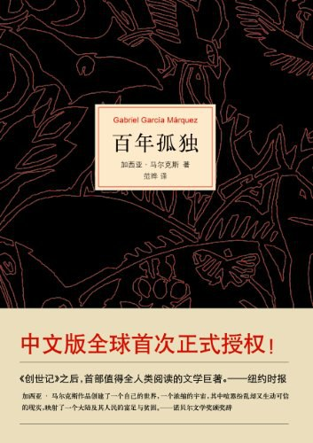

# 花开花落
## 《百年孤独》

《百年孤独》是魔幻现实主义文学的代表作，描写了布恩迪亚家族七代人的传奇故事，以及加勒比海沿岸小镇马孔多的百年兴衰，反映了拉丁美洲一个世纪以来风云变幻的历史。作品融入神话传说、民间故事、宗教典故等神秘因素，巧妙地糅合了现实与虚幻，展现出一个瑰丽的想象世界，成为20世纪最重要的经典文学巨著之一。1982年加西亚•马尔克斯获得诺贝尔文学奖，奠定世界级文学大师的地位，很大程度上乃是凭借《百年孤独》的巨大影响。

> 人们一派懈怠，而遗忘却日渐贪婪，无情地吞噬一点一滴的记忆。

## 《红楼梦》
《红楼梦》，中国古代章回体长篇小说，中国古典四大名著之一，一般认为是清代作家曹雪芹所著。小说以贾、史、王、薛四大家族的兴衰为背景，以富贵公子贾宝玉为视角，以贾宝玉与林黛玉、薛宝钗的爱情婚姻悲剧为主线，描绘了一批举止见识出于须眉之上的闺阁佳人的人生百态，展现了真正的人性美和悲剧美，可以说是一部从各个角度展现女性美以及中国古代社会世态百相的史诗性著作。

> 满纸荒唐言，一把辛酸泪。

# 漫卷云舒

