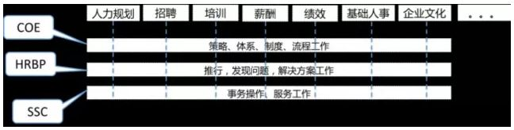

## 人力资源管理六大模块

* 人力资源规划、招聘与配置、培训与开发、绩效管理、薪酬福利管理、劳动关系管理。

  

##  人力资源管理三大支柱

### COE

人力资源专业知识中心或人力资源领域专家，职能高，属于三支柱的政策中心，工作内容主要是制定总体的人力资源战略、政策、流程、体系、方案等；

根据企业每年的战略目标，制定年度的招聘计划；整合招聘渠道；选择适合本企业的招聘方法；设计并优化招聘流程；监督招聘过程等；

制定员工信息管理的标准操作流程；

针对企业培训需求，选择合适的培训机构和资源，以保证最佳的培训效果；针对各业务部门的不同培训需求，有针对性地设计培训课程；

制定和完善集团所有的绩效考核流程；

组织薪酬市场调查，并评估本企业的薪酬状况的竞争能力；根据调查结果起拟调薪方案；根据企业战略及本年度财务预算，制定年度薪酬计划；

### HRBP

人力资源业务合作伙伴，中级职能，属政策执行类，主要工作内容是以HR专业角度去发现业务运行问题，提出建议，是更基于业务导向的人力资源解决方案提供和执行者；

与所在的业务部门经理确认招聘需求；拟定具体的岗位职责和任职要求、薪资待遇；协同用人部门经理面试、确认最终录用人员；协助新录用人员准备报到事宜；

组织人才测评；传递用人部门审批意见；监督员工信息管理流程等；

与所在部门经理沟通确定培训需求；根据所在部门业务情况和发展目标，分析培训需求，并提出可行的培训课程建议；

根据企业及部门战略目标，协助所在部门经理及员工制定合适的年度绩效考核目标；协助部门主管与员工进行绩效反馈、沟通，共同修订绩效目标并制定改进计划；监督指导和推进目标的完成和绩效考核；

统计员工绩效考核情况，制定所在部门每个员工的加薪及降薪情况；

### SSC

共享服务中心，基础职能岗位，工作内容主要是日常操作事务类事物，是标准化的服务提供者。

根据BP送达的招聘信息，选择合适的渠道发布招聘信息；收集、初步筛选简历并将简历发送给用人部门经理、安排面试等。

协助新员工准确录入自己的基本信息；及时更新员工薪资、信息数据等。

及时跟踪和反馈培训效果；整理和发布免费的在线学习和培训公开课等。

做好绩效数据的保密和维护工作；核算绩效工资；修订员工薪资情况等。

更新和维护员工薪资及相应信息；统计考勤，并根据绩效考核核算工资、发放工资、出具工资条等；统计薪资变化情况等。

> 简单来说，三支柱是基于HR六大模块，并将每个模块以制定战略——执行——基础事务的纵向工作方式进行划分。

## 推荐的读物

