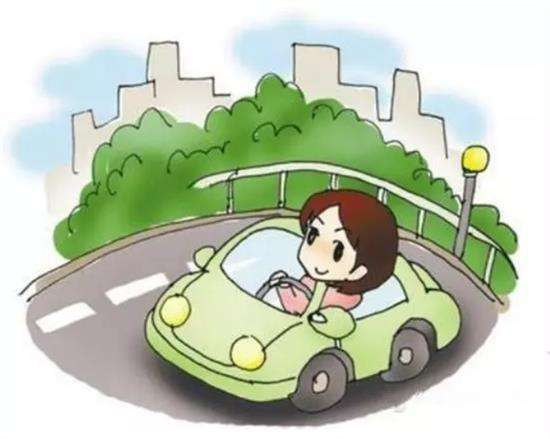

## 厨艺

## 驾驶

初学者的起步技能之一档启动。

汽车传动的设计依赖速度。如果强迫用第二个齿轮启动，它不仅会加重发动机的压力，而且可能造成离合器的提前损坏，所以无论它排量多少，都应该从低档位启动。并同时观察前面,左、右后视镜的车辆,是否有任何阻碍,特别是看到如果有任何障碍。注意安全;松开停车制动杆，牢牢握住方向盘，并抬起离合器踏板。

## 生活小妙招

> 1、点眼药水的时候，为避免眨眼睛，可以张开嘴巴，眼睛进了灰尘，闭上眼睛用力咳嗽几下，灰尘就出来了。
>
> 2、吃有异味的东西，在吃几颗花生米就可以让嘴里没有味道。
>
> 3、打嗝时，可以喝一点醋，也可以按手心，用一只手的大拇指按住另一只手的手心。
>
> 4、切洋葱等蔬菜时，可将其去皮放入冰箱冷冻室存放数小时后再切，就不会刺眼流泪了。
>
> 5、去除锅底的黏着物，只需要小苏打和保鲜膜。在锅表面有污渍的地方沾上水，涂抹上小苏打，用保鲜膜将锅整个包裹起来，放上一夜，第二天早上用百洁布擦洗，污渍就全部自动脱落。

